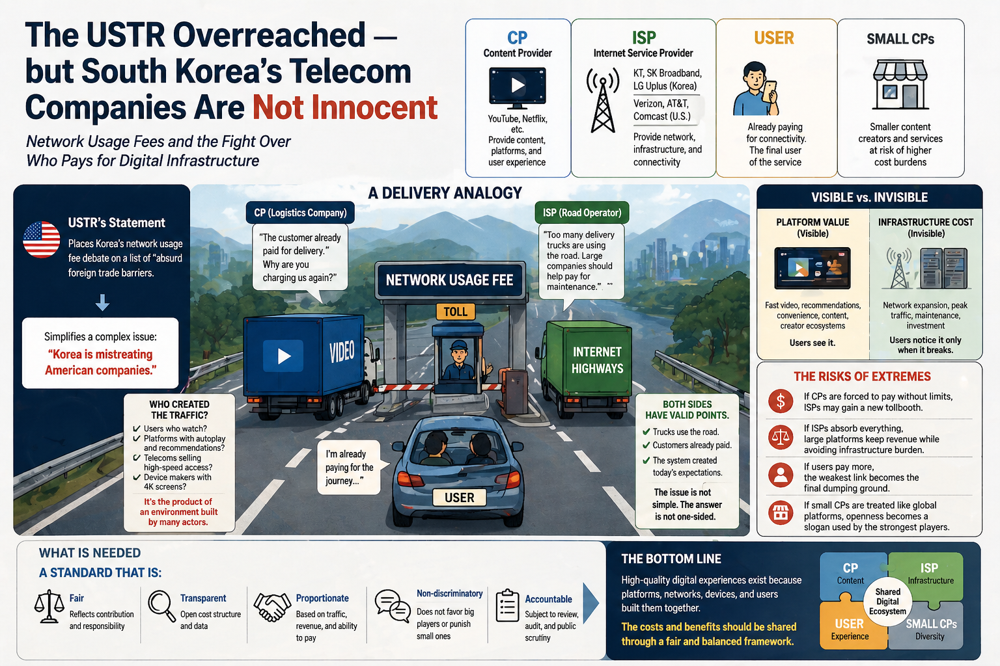

# Network Usage Fee Dispute as a Cost Attribution Problem

## One-line claim

Network usage fee disputes should not begin with “who pays?” but with “who structured the high-bandwidth digital environment that made the cost arise?”

## Why this case matters

The USTR framed South Korea’s network usage fee debate as an absurd foreign trade barrier. That framing matters because it turns a domestic infrastructure cost-allocation dispute into a trade-barrier narrative.

The case is useful because it shows how platform value, network cost, user exposure, and trade pressure become entangled.

## Actor map

| Actor | Role | Public claim | Main risk |
|---|---|---|---|
| Large CPs | High-bandwidth service designers | Internet openness / double charging | Cost avoidance |
| ISPs | Network operators | Network investment sustainability | Rent extraction |
| Users | Final consumers | Already paying | Final cost absorption |
| Smaller CPs | Low-buffer entrants | Market access | Entry barriers |
| Government | Rule-setter | Balance and regulation | Policy-space pressure |
| USTR / trade power | Upper-level framing actor | Trade barrier framing | Responsibility relocation |

## Diagnostic standard

A fair cost-attribution standard should consider:

- contribution to cost generation
- revenue gained from the cost-generating environment
- ability to shape the environment
- absorptive capacity
- system sustainability
- risk of passing costs downward
- risk of reframing responsibility through trade pressure

## Core conclusion

Large CPs and ISPs should absorb the primary burden, but only under rules that prevent:

- pass-through to users
- exclusion of smaller CPs
- ISP rent extraction
- degradation of open internet conditions
- trade-pressure reframing that prevents domestic cost-allocation debate

## Related public essay

- [The USTR Overreached — but South Korea’s Telecom Companies Are Not Innocent](https://jooyeolkim.substack.com/p/the-ustr-overreached-but-south-koreas)
