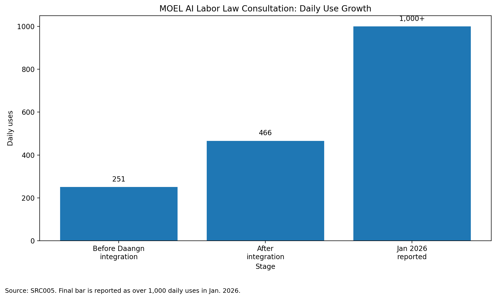
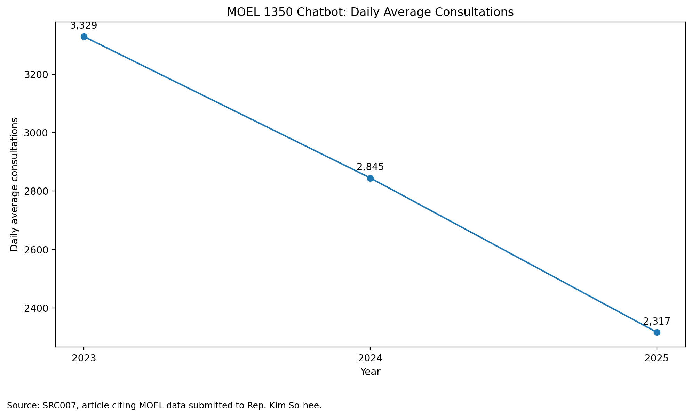
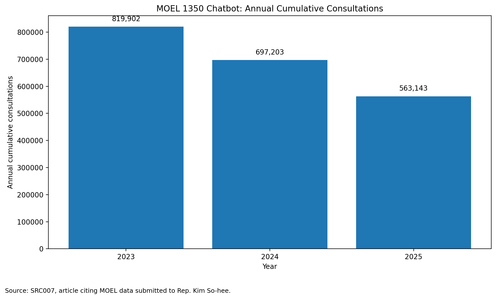
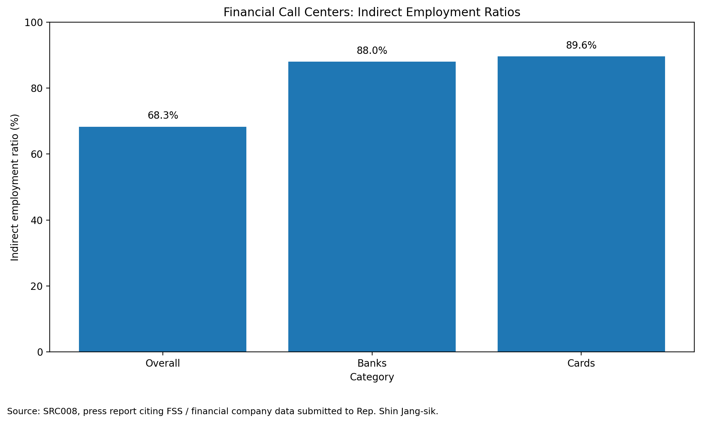
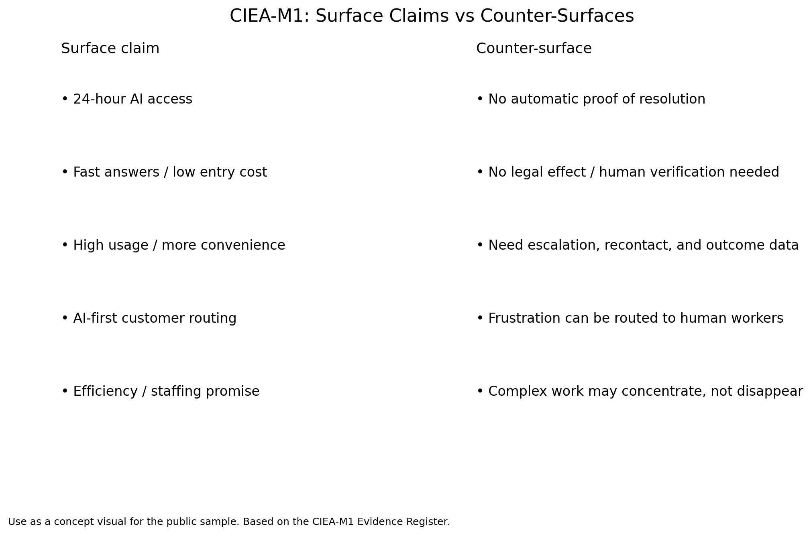

# Fast Answers, Slow Responsibility  
## Did AI Customer Support Remove the Bottleneck, or Move It?

**Status:** Public sample / portfolio proof  
**Framework:** CIEA-M1 Customer-Facing Bottleneck Module  
**Version:** v0.2 with visual embeds  
**Case:** AI customer support in Korean public and financial service settings  
**Purpose:** Demonstrate how CIEA-M1 tests whether apparent efficiency removes the real bottleneck or relocates it.

---

## 1. The answer looked useful. That was exactly the problem.

A hypothetical user asks an AI labor-law counselor a simple-looking question:

> I worked at a convenience store for three months, and my last month’s wage has not been paid. The owner says business is difficult and keeps saying they will pay next month. I did not sign a written employment contract, but I have KakaoTalk records about my work schedule and wages. What should I do?

The answer looks useful.

It identifies the issue as possible unpaid wages. It explains that the absence of a written contract does not necessarily prevent a claim if other evidence exists. It tells the user to preserve KakaoTalk records, schedules, and wage-related messages. It points to the competent labor office and explains possible steps such as a complaint, investigation, corrective order, and further legal remedies.

Then the boundary appears.

The service’s own terms state that AI answers have **no legal effect**, that important matters should be checked with **1350**, a local labor office, or a certified labor attorney, and that the service is **information provision**, not a civil-petition processing system.

This is not a story about a useless chatbot.

It is more interesting than that.

The answer may be helpful. The user may feel oriented. The system may reduce the first search cost. But the legally decisive question remains outside the answer:

> Can the user rely on this answer before taking action?

CIEA-M1 starts there.

---

## 2. What the surface claims show

AI customer support is not meaningless. A fair evaluation should begin by acknowledging the real surface improvements.

The Ministry of Employment and Labor’s AI Labor Law Consultation service is presented as a public-sector AI counseling tool that widens access to labor-law information. The reported performance surfaces include 117,000 uses in 2025, average answer generation in seconds, night and weekend use, foreign-language support, and a reported reduction in labor-law information search time. The service is also scheduled to expand toward document analysis and case-filing linkage.

A financial-service example points in the same direction. KB Kookmin Card publicly links AI callbots, chatbots, digital ARS, instant consultation, routine task automation, AI consultation-support systems, and counselor welfare programs to high call-center service quality.

These claims should not be dismissed.

AI can help users ask a first question before they call an office. It can summarize options. It can produce checklists. It can lower psychological and technical entry costs. It can route users toward the right institution. It can help someone who does not yet know whether the problem is wage arrears, unemployment benefits, workplace harassment, industrial accident compensation, or something else.

For low-risk orientation, that is real value.

<figure>
  
  <figcaption><em>Surface claim example: reported daily-use growth for MOEL AI Labor Law Consultation.</em></figcaption>
</figure>

But CIEA-M1 does not ask only whether a metric improved. It asks whether the metric found the real evaluation center.

In this case, the center is not simply:

- number of answers;
- answer speed;
- 24-hour availability;
- multilingual access;
- chatbot adoption;
- award claims;
- call deflection.

The center is:

- whether the issue was actually resolved;
- whether the user understood the risk;
- whether a human or institution had to take over;
- whether the answer was legally safe to rely on;
- whether the service created recontact, abandonment, or delay;
- whether worker burden decreased or merely changed form;
- who bears responsibility when the answer is wrong.

That is the CIEA-M1 question:

> Did AI customer support remove the bottleneck, or move it?

---

## 3. First: identify which interface the number belongs to

Before evaluating AI customer support, CIEA-M1 performs a boring but decisive step: source-line separation.

In the Korean public-service case, several similar-looking services exist side by side.

First, there is the **AI Labor Law Consultation** service. This is the line associated with the government’s positive performance claims: use volume, speed, multilingual support, attorney data verification, and future expansion.

Second, there is the **1350 customer consultation center chatbot**. This is a separate customer-center chatbot line, officially described as an AI counselor that answers employment-labor administrative inquiries. Its current official scope is unemployment benefits and local employment-center guidance, with 365-day, 24-hour availability.

Third, there are customer-center operation CSVs covering telephone, internet, and smartphone consultation volumes. Those are official operation-volume context sources, but they are not chatbot usage data.

These lines cannot be merged.

If a positive metric from one line and a negative metric from another line are mixed, the evaluation becomes useless. CIEA-M1 therefore asks, before anything else:

> Which interface does this number describe?

This is not clerical tidiness. It is the first control against false evaluation.

---

## 4. The legal boundary: fast answer is not accountable consultation

The AI Labor Law Consultation case exposes the legal boundary more sharply than a generic chatbot example.

The public-facing service says “AI labor-law consultation.” It is associated with government branding and professional labor-attorney collaboration. It gives case-specific, actionable guidance. A user can receive an answer that looks like a practical next-step plan.

But the terms draw a different boundary.

The terms state that AI answers have no legal effect. They state that important matters should be checked with 1350, local labor offices, or certified labor attorneys. They state that the service is not a civil-petition processing system but an information-provision service. They also state that user inputs may be used for service improvement and new service development, and that input content is transmitted to OpenAI API for service operation.

This does not make the service useless.

It does mean the service should not be classified as a replacement for accountable consultation.

A public AI counselor can reduce search time and widen access. But if its own terms deny legal effect, deny civil-petition processing status, and redirect important matters to human institutions or professionals, then its performance cannot be judged as if it resolved the legal problem.

This is where CIEA-M1 identifies a mechanism:

### Risk Classification Burden

The user must classify whether their question is a low-risk information request or a high-stakes legal or administrative action point.

That is not trivial.

Many users do not approach labor-law services with clean categories in mind. A question like “Can I receive unemployment benefits?” or “What should I do if I have not been paid?” may look like a simple information query. But the answer can affect deadlines, evidence, reporting strategy, employer retaliation risk, eligibility, and future legal position.

The AI answer may be fast. The user’s risk classification is not.

---

## 5. The interface creates reliance; the terms withdraw responsibility

There is another layer.

The limitation is disclosed. It is not absent.

But it is disclosed inside the terms.

In the observed entry flow, the terms and required consent appear in scrollable boxes. The user can check consent and proceed without the interface requiring them to scroll to the end of the terms. The most important legal-boundary statements—no legal effect, not petition processing, verify important matters with 1350 or experts—are not foregrounded in the default visible entry view.

This creates a second CIEA-M1 mechanism:

### Terms-Visibility Gap

The decisive responsibility limits exist, but they are placed in a low-salience layer.

The front-facing service produces consultation-like reliance. The terms withdraw legal effect.

That split matters.

The problem is not that the government failed to disclose a limitation. The problem is that the limitation appears in a different behavioral layer from the one that generates user trust.

A concise formulation:

> The interface says “consultation.”  
> The terms say “no legal effect.”  
> The user must decide which one matters before acting.

This is not a claim that the interface is illegal. It is a responsibility-design problem.

---

## 6. The chatbot existed, but the human bottleneck did not disappear

The 1350 chatbot line adds another counter-surface.

A press report using Ministry of Employment and Labor data submitted to a lawmaker reported that daily-average chatbot consultations fell from 3,329 in 2023 to 2,317 in 2025. Annual cumulative chatbot consultations reportedly fell from 819,902 to 563,143, a 31.3 percent decline.

The same report states that phone inflow to human counselors declined only slightly. It also quotes the ministry explaining that the chatbot’s unemployment-benefit domain is difficult to complete because users often request connection to a practical human officer.

<figure>
  
  <figcaption><em>Reported decline in the separate MOEL/1350 chatbot line. This should not be merged with the AI Labor Law Consultation service.</em></figcaption>
</figure>

<figure>
  
  <figcaption><em>Reported annual cumulative consultation decline for the separate MOEL/1350 chatbot line.</em></figcaption>
</figure>

This is the service-core point.

The chatbot may exist. It may be available. It may answer. But unemployment-benefit cases often require a human or institution that can handle the practical consequences.

The human bottleneck did not disappear.

It reappeared as escalation need.

CIEA-M1 does not interpret this as proof that all public AI counseling fails. The raw monthly logs, completion rates, escalation rates, recontact rates, satisfaction data, and abandonment data are still missing.

But the reported pattern is enough to reject a simple substitution narrative.

> Availability is not resolution.  
> Answering is not completion.  
> Deflection is not proof of solved demand.

---

## 7. What happens to the remaining human work?

The call-center evidence from public and financial-sector sources points to a repeated pattern.

AI can absorb simple and standardized contacts. That may reduce visible volume. But the remaining human work may become harder.

Reports and interviews describe cases where simple inquiries move to AI, while human agents receive ambiguous, exceptional, emotional, or high-stakes cases. Elderly or digitally vulnerable users may still need step-by-step guidance. Customers who pass through AI, ARS, or chatbot layers may reach human agents already frustrated. Workers may first have to apologize for delays caused by the automated layer before addressing the original problem.

This is the second major CIEA-M1 mechanism:

### Bottleneck Externalization

The bottleneck is not removed. It is shifted to another actor or another layer.

In AI customer support, the shifted bottleneck can land in several places:

- the user’s ability to classify legal risk;
- the user’s ability to retry, rephrase, or escalate;
- the human agent who receives unresolved complex cases;
- the worker who absorbs customer anger;
- the institution that must handle the eventual formal complaint;
- the contractor workforce that bears reduced staffing and intensified work.

This is why call reduction alone is an unsafe metric.

If AI removes easy contacts and leaves difficult cases, a smaller human workload is not guaranteed. The visible count may fall while the weight of each remaining case rises.

---

## 8. Anger routing and hidden labor

CIEA-M1 also tracks what conventional service metrics often ignore.

### Anger Routing

If a user fails with the AI layer, waits through ARS, repeats information, or cannot reach a human, the final human agent receives not only the original problem but the accumulated frustration.

The worker becomes the last surface of a system they did not design.

This matters because the organization may count the AI layer as improved access while the human worker experiences concentrated complaint intensity.

### Hidden Labor and Knowledge Extraction

Several sources also describe worker concerns that consultation know-how, corrected transcripts, STT/TA data, or accumulated practical knowledge become training material for AI systems.

This is not just “technology assisting workers.” It can become a one-way extraction process:

- workers build knowledge through years of interaction;
- the system captures that knowledge;
- the same system is then used to automate, monitor, or evaluate the workers;
- recognition, consent, compensation, and control remain unclear.

This is why CIEA-M1 separates “AI support tool” from “AI monitoring and extraction layer.”

An AI tool can support workers. But that claim must be checked against hidden verification work, data-cleaning labor, monitoring burden, and downstream staffing pressure.

---

## 9. The financial-sector structure matters

The financial call-center context adds a governance layer.

A press report citing lawmaker-submitted/FSS-company material states that, as of 2025 H1, 16,002 of 23,426 covered financial-sector call-center workers were indirectly employed, an overall rate of 68.3 percent. The reported ratios were especially high for banks and card companies.

<figure>
  
  <figcaption><em>Structural context: reported indirect-employment ratios in financial-sector call centers.</em></figcaption>
</figure>

This is not direct proof that AI caused job loss.

It is structural context.

When AI performance claims enter a highly outsourced call-center system, responsibility can fragment across:

- the principal financial firm;
- the contractor or outsourcing company;
- the AI vendor;
- the frontline worker;
- the customer.

That matters for evaluation.

If the bank owns the customer relationship but the call-center labor is outsourced, and if AI is introduced to reduce visible human contact, then service failure, emotional labor, job instability, and accountability may be distributed away from the entity that benefits from the efficiency claim.

This is another CIEA-M1 mechanism:

### Responsibility Fragmentation

The performance claim is centralized.  
The cost of failure is distributed.

---

## 10. Mechanism map

<figure>
  
  <figcaption><em>CIEA-M1 visual summary: a surface improvement is not interpretable until counter-surfaces are checked.</em></figcaption>
</figure>

| CIEA-M1 mechanism | What moves? | In this case |
|---|---|---|
| **Bottleneck Externalization** | The bottleneck moves rather than disappears. | AI absorbs simple contacts; complex cases return to humans. |
| **Anger Routing** | Frustration moves to the final human interface. | Customers reach agents after failed or delayed AI interaction. |
| **Risk Classification Burden** | Risk judgment moves to the user. | Users must know whether an AI answer is safe to rely on. |
| **Responsibility Externalization** | Accountability moves outside the AI answer. | Terms deny legal effect and redirect users to humans/institutions. |
| **Terms-Visibility Gap** | Key limits move into low-salience terms. | Legal-effect limits exist but are not foregrounded in the entry flow. |
| **Hidden Labor / Knowledge Extraction** | Worker knowledge moves into AI systems. | Consultation know-how and corrected data may train or improve AI. |
| **Responsibility Fragmentation** | Accountability splits across organizations. | Principal firms, contractors, vendors, workers, and users absorb different parts of failure. |
| **Organizational Analgesia** | Surface metrics reduce visible pain. | Usage, speed, or deflection can hide unresolved cases, abandonment, or worker burden. |

---

## 11. Judgment: orientation layer, not accountable consultation

AI customer support should not be rejected.

It should be correctly classified.

The evidence supports a narrow but important conclusion:

> AI counseling can be a useful orientation layer.  
> It can lower the threshold for asking a first question.  
> It can summarize, route, and prepare.  
> It can help users identify evidence, institutions, and possible next steps.

But it is not accountable consultation unless it also carries:

- legal effect or a clear legal boundary;
- error responsibility;
- human escalation guarantees;
- completion and recontact tracking;
- user comprehension data;
- privacy and data-use safeguards;
- worker-burden measurement;
- outcome evidence after the answer.

Without those counter-surfaces, “AI counseling” is closer to an interactive FAQ with an authoritative interface than a replacement for human counseling.

This is the central CIEA-M1 result:

> AI counseling can lower the threshold for asking.  
> It does not, by itself, lower the threshold for accountable action.

So the policy and management question should not be:

> How many answers did the AI generate?

It should be:

> Which bottleneck did the AI remove, and which bottleneck did it move?

---

## 12. What CIEA-M1 would require before accepting replacement claims

Before AI customer support is used to justify reduction of human counselors, CIEA-M1 would require at least the following evidence:

| Required evidence | Why it matters |
|---|---|
| Actual resolution rate | Shows whether users’ problems were solved. |
| Human escalation rate | Shows whether the human bottleneck remains. |
| Recontact rate | Detects unresolved or unclear answers. |
| Abandonment / quiet-exit data | Detects hidden failure where users give up. |
| Error and correction data | Shows what happens when AI gives wrong guidance. |
| User comprehension data | Especially important for legal and multilingual support. |
| Legal-effect and responsibility design | Determines whether answers are accountable. |
| Worker workload after AI | Shows whether simple calls disappeared but complex work intensified. |
| Emotional-labor indicators | Detects anger routing. |
| Hidden labor / data-use governance | Tracks whether worker/user inputs are extracted into AI systems. |
| Channel-specific metrics | Prevents mixing chatbot, telephone, AI legal consultation, and human chat data. |

Until these are available, AI customer-support performance claims should be treated as **surface claims requiring audit**, not as proof of true service improvement.

---

## Appendix A — Source Register Summary

This public sample is based on an internal evidence register. Key source roles:

| Source | Role |
|---|---|
| **SRC001** | AICC user/worker survey counter-surface anchor |
| **SRC002** | Public/financial call-center AI report: mechanisms, survey, interviews, policy recommendations |
| **SRC003** | MOEL telephone/internet/mobile customer-center operation CSV context |
| **SRC004** | Interview-based field article on “can AI” call-center mechanisms |
| **SRC005** | MOEL AI Labor Law Consultation official performance claim |
| **SRC005A** | AI Labor Law Consultation terms: no legal effect, information-service boundary, data use |
| **SRC005B** | Terms-visibility UI addendum |
| **SRC006** | 1350 customer-center chatbot official identity and scope |
| **SRC007** | Reported 1350 chatbot decline and human-escalation limits |
| **SRC008** | Financial call-center workforce / outsourcing structure |
| **SRC009** | KB Kookmin Card AI consultation / KSQI positive claim |

---

## Appendix B — Overclaim Guard

This sample does **not** claim:

- AI counseling is useless.
- AI counseling is illegal.
- All AI customer-support systems fail.
- The 1350 chatbot and AI Labor Law Consultation are the same service.
- Usage decline proves its cause.
- Surface metrics are false.
- Company or government claims are bad faith.
- Human counselors can never be partially supported by AI.

This sample claims:

- AI customer support can improve access and early orientation.
- But access, speed, and usage do not prove accountable resolution.
- In high-stakes public and financial-service domains, evaluation must include legal responsibility, human escalation, risk classification, hidden labor, customer frustration, and worker burden.
- CIEA-M1 is designed to find whether the real bottleneck was removed or displaced.
