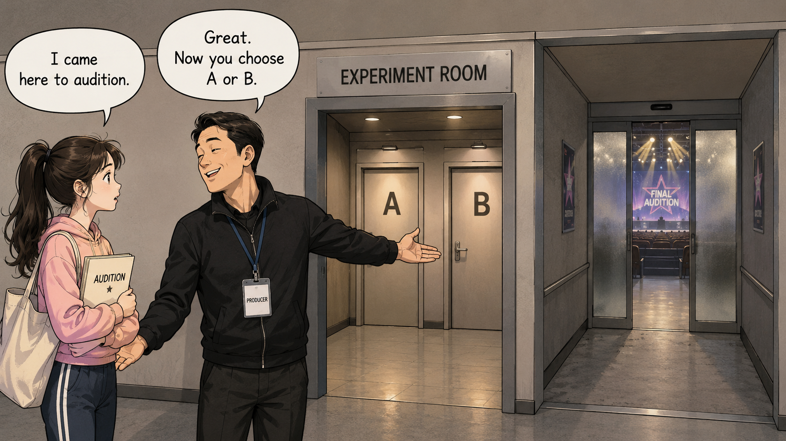
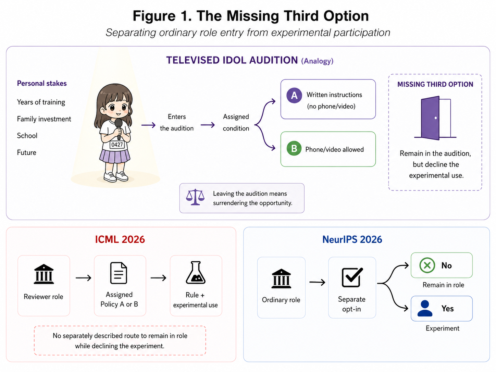

<strong>Working paper · Version 1.2 · July 2026 · Not peer reviewed</strong> Submitted to SSRN and currently under review. SSRN Abstract ID: 7174178.

# You Agreed to the Rule. Did You Agree to the Experiment?

## ICML 2026 and the missing boundary between review duty and experimental participation

Agreement to perform a role under institutional rules does not automatically settle agreement to have that role used as an experimental condition.

  <a class="button primary" href="../assets/papers/rule-experiment/Kim_Rule_Experiment_Boundary_SSRN_v1.2.pdf">Read the working paper (PDF)</a>
  <a class="button secondary" href="https://papers.ssrn.com/sol3/papers.cfm?abstract_id=7174178">View the SSRN record</a>
  <a class="button secondary" href="#figure-1">View Figure 1</a>

<figure>
  
  <figcaption><strong>Editorial illustration.</strong> A fictional idol-audition contestant says, “I came here to audition.” The producer answers, “Great. Now you choose A or B.” This image is a public-facing illustration of the paper’s central problem, not Figure 1 from the manuscript.</figcaption>
</figure>

## The question

ICML 2026 assigned reviewers enforceable AI-use rules while also using some policy assignments to compare outcomes under Policy A and Policy B. Some reviewers violated the assigned rule, and that breach matters. It does not answer a different question:

> **When did agreement to a review rule become agreement to participate in an experiment?**

The paper does not allege a legal violation, an IRB failure, or research misconduct. It asks a narrower governance question: whether a reviewer could decline the experimental use of an assignment while remaining in the ordinary reviewing role, particularly where reciprocal-review conduct could affect the reviewer’s own submissions.

## The missing third option

The paper uses a fictional televised idol audition to isolate the distinction. A contestant enters to audition. The organizer then assigns her to one of two experimental teaching conditions. Leaving means surrendering the opportunity altogether.

The missing option is not another experimental condition. It is:

> **I will remain in the underlying process, but I do not agree to the experimental use layered onto it.**

## Why the comparison matters

The ICML policy made the rule, enforcement mechanism, and possible experimental comparison visible. What its public materials did not separately describe was a route for declining experimental use while remaining in the reviewer role.

NeurIPS 2026 provides a contrast. Its AI-assisted reviewing experiment used a separate opt-in boundary for authors and reviewers, while ordinary reviewing obligations and conference authority remained in place. ICML’s own 2023 ranking experiment also separated analysis from that year’s paper decisions.

These comparisons do not prove wrongdoing. They show that an institution can preserve an ordinary gate while marking where experimental participation begins.

<h2 id="figure-1">Figure 1 · The missing third option</h2>

<figure>
  
  <figcaption><strong>Figure 1.</strong> The audition analogy illustrates why leaving an opportunity is not equivalent to declining only an experiment. The lower panels contrast ICML’s publicly described combination of policy assignment, enforcement, and experimental comparison with NeurIPS’s separate opt-in boundary. The diagram is a simplified representation of the relevant participation structures.</figcaption>
</figure>

## Core conclusion

ICML explained the rule, documented the breach, defended enforcement, and described the experimental comparison. The remaining boundary question is whether reviewers had a separately described route to decline experimental use while remaining in the ordinary role.

> **You agreed to the rule. Did you agree to the experiment?**

A serious institution should be able to answer both questions separately.

## Citation

Kim, Jooyeol. 2026. “You Agreed to the Rule. Did You Agree to the Experiment? ICML 2026 and the Missing Boundary Between Review Duty and Experimental Participation.” Working paper, Version 1.2.

## Status and disclosure

- **Status:** Working paper; submitted to SSRN and currently under review.
- **SSRN Abstract ID:** 7174178.
- **Peer review:** Not peer reviewed.
- **AI use:** Generative AI tools were used during drafting and revision to test arguments, improve structure, check internal consistency, and edit language. The author directed the analysis, independently verified factual claims against the cited sources, substantially revised the text, and assumes full responsibility for the final manuscript.
